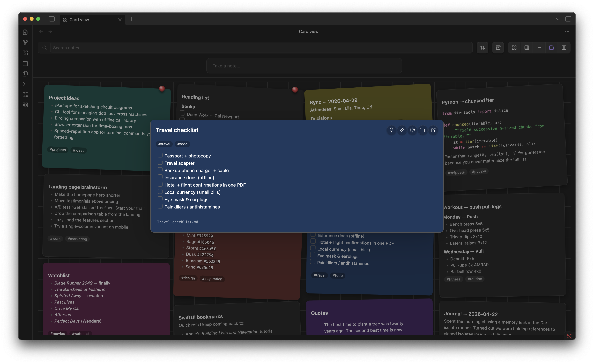

# Notekeeper

A Google Keep–style masonry of cards for your Obsidian vault. Browse, capture, pin, color, archive, and filter your notes from one screen — without leaving the grid.



Click any card to open a full markdown-rendered preview with one-click pin / edit / color / archive / open-in-tab actions:


## Features

- **Masonry card layout** — every note as a card, sized to its content, balanced across columns
- **Quick capture** — type into the centered input, hit Enter to create a note
- **Inline edit** — click the pencil to edit a card without leaving the view
- **Note preview modal** — click any card to open a full markdown-rendered preview with one-click pin / color / archive / open-in-tab actions
- **Pin, color, archive** — per-card hover actions; 12-color palette
- **Drag pinned cards** to reorder them
- **Multi-select** — shift- or cmd-click to select multiple cards; bulk pin / archive / color / delete from a floating action bar
- **Right-click context menu** — rename, copy link, copy embed, open in new pane, delete
- **Inline checkboxes** — `- [ ]` items render as live checkboxes that update the source file
- **Image thumbnails** — first attached image surfaces at the top of each card
- **Backlinks badge** — count of incoming links on each card
- **Smart search** — combine free text with `tag:`, `pinned:`, `archived:`, `color:`, `path:`, `is:` filters
- **Sort by** modified, created, or title — pinned cards always float to the top
- **Three densities** — comfortable, compact, list view
- **Lazy infinite scroll** — fast on vaults with thousands of notes; cards populate only as they scroll into view
- **Auto-collapse side panes** — Obsidian's left and right sidebars collapse while the card view is active and restore when you leave
- **Keyboard navigation** — arrow keys, `Enter`, `e` (edit), `p` (pin), `a` (archive), `x` (select), `/` (focus search)
- **Tag chips are clickable** — filter by any label with one click; clear with the active-filter chip's `×`
- **Manage labels** command — rename a tag across the whole vault and assign per-tag colors

## Frontmatter conventions

Cards read these fields from each note's YAML frontmatter:

```yaml
---
pinned: true
color: "#5c2b29"
archived: false
tags: [ideas, work]
pinOrder: 1
---
```

- `pinned: true` floats the card to the top
- `color` paints the card background (or a left border, depending on settings)
- `archived: true` hides the card from the default view; toggle the archive button in the toolbar to see it
- `tags` populate the searchable label list
- `pinOrder` (number) controls the order among pinned cards; updated automatically when you drag

By default Notekeeper stores `pinned`, `archived`, and `color` in its own `data.json` keyed by file path — not in your notes' frontmatter — so toggling them doesn't touch the file or bump its mtime. Frontmatter values are still read as a fallback so notes you've authored manually with these fields keep working.

## Search syntax

Type any of these in the search box:

| Token | Meaning |
| --- | --- |
| `tag:foo` | Notes carrying the `foo` tag (frontmatter or inline) |
| `pinned:true` / `pinned:false` | Filter by pin state |
| `archived:true` | Show only archived notes |
| `color:#5c2b29` | Notes with this exact color |
| `path:Inbox` | Notes whose path includes "Inbox" |
| `is:archived`, `is:pinned` | Shortcuts for the above |
| Free text | Matches title and path |

Combine freely: `tag:work pinned:true urgent`

## Keyboard shortcuts

When the card view has focus:

| Key | Action |
| --- | --- |
| `/` | Focus the search box |
| `↑ ↓ ← →` | Move focus between cards |
| `Enter` | Open the focused card in the preview modal |
| `e` | Begin inline edit on the focused card |
| `p` | Toggle pin |
| `a` | Toggle archive |
| `x` | Toggle selection |
| `Esc` | Clear selection / exit edit mode |

## Settings

- **Notes folder** — limit the card view to a single folder (leave empty for the entire vault)
- **Preview lines** — body lines visible on each card
- **Color as left border** — show note color as a 4px left border instead of the full card background
- **Pinned section header** — group pinned cards under a "PINNED / OTHERS" divider
- **Show image thumbnails** — render the first attached image on each card
- **Auto-collapse sidebars in card view** — collapse Obsidian's side panes while the card view is active

## Commands

- **Open card view** — opens the masonry view in a new tab (also accessible via the ribbon icon)
- **Manage labels** — opens a modal listing every tag in your vault, with rename and color actions

## Installation

### From the community plugin store (after approval)

Open Obsidian → Settings → Community plugins → Browse, search "Notekeeper", install, and enable.

### Manual install

1. Download `main.js`, `manifest.json`, and `styles.css` from the [latest release](https://github.com/PhilemonChiro/obsidian-notekeeper/releases)
2. Copy them into `<vault>/.obsidian/plugins/notekeeper/`
3. Reload Obsidian and enable Notekeeper in Settings → Community plugins

## License

MIT — see [LICENSE](./LICENSE).
